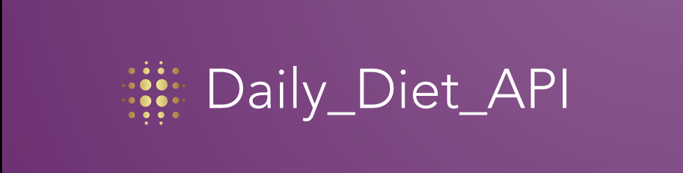
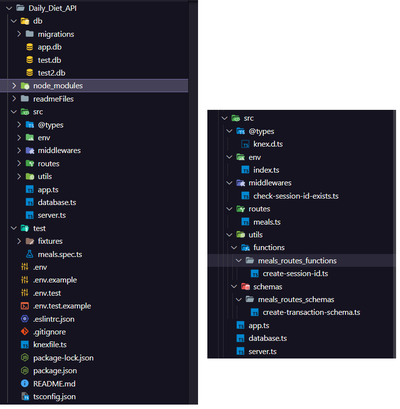

<div>
  
</div>

# 🎯 Contexto

Este projeto é um api que gerencia a dieta de uma pessoa, faz parte dos desafios do programa Ignite-Node do rocketSeat.

Os requisitos para desenvolvimento do projeto estão no [LINK](https://efficient-sloth-d85.notion.site/Desafio-02-be7cdb37aaf74ba898bc6336427fa410)

# 💻 Tecnologias

| Ferramenta   | Sumário                                         | Descrição                                                                                                                                                                                                                                |
| ------------ | ----------------------------------------------- | ---------------------------------------------------------------------------------------------------------------------------------------------------------------------------------------------------------------------------------------- |
| `Node.js`    | Ambiente de execução JavaScript                 | Node.js é um ambiente de execução JavaScript que permite que você execute código JavaScript no servidor. Ele é conhecido por sua eficiência e escalabilidade, sendo amplamente utilizado para desenvolver aplicativos web e de back-end. |
| `Fastify`    | Framework web rápido para Node.js               | Fastify é um framework web para Node.js que se destaca por sua alta performance e baixa sobrecarga. Ele é usado para construir APIs web eficientes e escaláveis.                                                                         |
| `npm`        | Gerenciador de pacotes do Node.js.              | npm é o gerenciador de pacotes padrão para o Node.js. Ele permite que você instale, atualize e gerencie as dependências do seu projeto JavaScript de forma fácil e eficiente.                                                            |
| `Typescript` | Linguagem de programação tipada.                | TypeScript é uma linguagem de programação que adiciona tipagem estática ao JavaScript. Isso ajuda a identificar erros de código em tempo de compilação e melhora a manutenibilidade de grandes projetos.                                 |
| `Knex`       | Construtor de consultas SQL para Node.js.       | Knex é uma biblioteca para Node.js que simplifica a construção de consultas SQL e a interação com bancos de dados relacionais. É uma escolha popular para trabalhar com bancos de dados em Node.js.                                      |
| `Sqlite3`    | Banco de dados SQL leve                         | Sqlite3 é um banco de dados SQL leve que é amplamente utilizado em aplicativos móveis e pequenos projetos. Ele é autocontido e não requer um servidor separado para operar.                                                              |
| `Zod`        | Validador de esquema TypeScript                 | Zod é uma biblioteca que ajuda na validação de dados em TypeScript. Ela permite definir esquemas de validação de forma concisa e segura, tornando mais fácil garantir a integridade dos dados em seu aplicativo.                         |
| `Vitest`     | Estrutura de teste para JavaScript e TypeScript | Vitest é uma estrutura de teste que facilita a escrita e execução de testes para código JavaScript e TypeScript. Ela fornece ferramentas para automatizar testes e verificar a qualidade do código.                                      |
| `SuperTest`  | Biblioteca de teste HTTP para Node.js           | SuperTest é uma biblioteca para Node.js que facilita o teste de APIs HTTP. Ela permite simular solicitações HTTP para testar o comportamento de seu aplicativo em relação a endpoints de API.                                            |

# 📝 Como rodar o projeto:

| Passo                                                | Comando                                                                  |
| ---------------------------------------------------- | ------------------------------------------------------------------------ |
| Instale as dependências após acessar a pasta projeto | `npm install`                                                            |
| Configure as Variaveis de ambiente                   | `configure o .env conforme o modelo do .env.example e .env.test.example` |
| Rode as migrations                                   | `npm run knex:migrate:latest`                                            |
| Rode o projeto                                       | `npm run start`                                                          |
| Rode os testes                                       | `npm run test`                                                           |

# 📌 Estrutura do projeto:

<div>
  
</div>

### Breve Explicação da estrutura do projeto

```bash


projeto/
├── src/
│   ├── server.ts         # Inicialização do servidor
│   ├── app.ts            # Configuração do aplicativo (plugins, cookies, rotas, etc.)
│   ├── database/
│   │   ├── db/           # Migrations e banco de dados SQLite
│   │   └── index.ts      # Configurações do banco de dados
│   ├── env/
│   │   └── index.ts      # Variáveis de ambiente e tipagem com Zod
│   ├── @types/
│   │   └── knex/         # Tipagens das tabelas do banco de dados
│   │                  
│   ├── routes/
│   │   └── *.ts              # Configuração das Rotas
│   ├── middlewares/
│   │   └──               # Middleware de autenticação do usuário
│   ├── utils/
│   │   └── *              # Funções de utilidade reutilizáveis
├── test/
│   ├── end2end/          # Testes end-to-end
│   └── fixtures/         # Dados para testes
├── .env                   # Arquivo de variáveis de ambiente
├── .env.example           # Modelo de variáveis de ambiente
├── .env.test.example      # Modelo de variáveis de ambiente para teste
├── knexfile.ts             # Configurações do Knex
├── ...                   # Outros arquivos e pastas do projeto

```

### 📚 Endpoints:

| Verbo  | URL                                            | Corpo da Requisição                                                                     | Nota                                                                                                                                                                                                     |
| ------ | ---------------------------------------------- | --------------------------------------------------------------------------------------- | -------------------------------------------------------------------------------------------------------------------------------------------------------------------------------------------------------- |
| POST   | `http://localhost:3333/meals`                  | `json { "name": "churrasco", "description": "churrasco de picanha", "isInDiet": true }` | Nenhum                                                                                                                                                                                                   |
| GET    | `http://localhost:3333/meals`                  | Nenhum                                                                                  | O usuário deve estar logado (ter realizado um post) para poder acessar este endpoint.                                                                                                                    |
| GET    | `http://localhost:3333/summary`                | Nenhum                                                                                  | O usuário deve estar logado (ter realizado um post) para poder acessar este endpoint. Exemplo de Resposta: `json { "summaryMeals": { "totalMeals": 4, "totalMealsInDiet": 3, "totalMealsOutDiet": 1 } }` |
| PUT    | `http://localhost:3333/meals/{id_da_refeição}` | `json { "name": "churrasco", "description": "churrasco vegano", "isInDiet": true }`     | O usuário deve estar logado (ter realizado um post) para poder acessar este endpoint.                                                                                                                    |
| DELETE | `http://localhost:3333/meals/{id_da_refeição}` | Nenhum                                                                                  | O usuário deve estar logado (ter realizado um post) para poder acessar este endpoint.                                                                                                                    |

## 💡 Aprendizados

- O projeto me ensinou como utilizar knex, utilizar a ferramenta Zod, utilizar cookies e fazer testes end2end com supertest.


## Licença 📄

[MIT](https://choosealicense.com/licenses/mit/) 📜